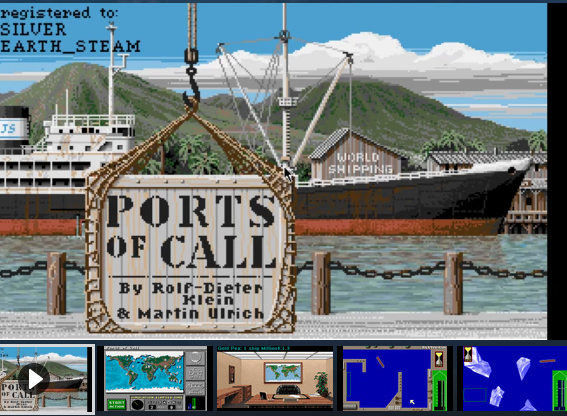

When i started with Computers i first got my beloved Commodore 64 where i made the first expirience with Games programming and also Games cracking – Games where to expensive and easy to crack – so we removed the copy protection and added our own little intros which where mainly some sprite animations with some raster colors or some stolen sounds or music. I will not mention my cracker name or our cracker group, however long time ago. After the C64 times and took all available money and bought an Amiga 1000 – and the first two games i remember where DOC (Defender of the Crown) and POC (Ports of Call). Ports of Call is one of the favorite games of all time and much later i found out that the game was developed by Rolf Dieter Klein, a genius of the time who even had his own Computer TV Show in the German Television. Anyhow, since than i have still the idea to come up with a remake of Ports of Call, but this time with real vessel data, real shipyards, real ports and all the things i am dealing today. Below are some videos about Ports of Call and an interview with Rolf Dieter Klein (in German)

