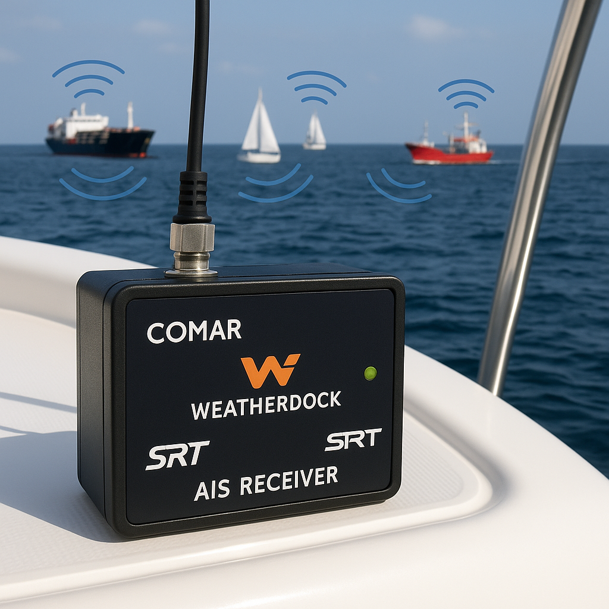

### A Look Back: The Early Days of AIS Receivers

Ten years ago, AIS (Automatic Identification System) receivers were little more than basic radios with NMEA serial output. Enthusiasts and early adopters would rig these systems with serial-to-Ethernet adapters to transmit data over UDP or TCP protocols across the internet. It was an open world—no encryption, no user authentication, and certainly no remote monitoring capabilities.

### Pioneering Efforts and Initial Progress

I was among the first to push for a more integrated solution, encouraging companies like SRT and Weatherdock to develop add-on “hats” and dedicated receivers compatible with the Raspberry Pi Model 3. This felt like a step in the right direction at the time. Unfortunately, this is still where we are stuck today—a decade later.

### Innovation Stalled, Prices Inflated

Since then, innovation has ground to a halt. There’s been no meaningful evolution in hardware or software design. Yet, paradoxically, the prices for these outdated, underwhelming devices have surged.

*   **Comar** now charges between €750–€1,000 for a device whose hardware is worth no more than $100.
*   **Weatherdock** isn’t far behind, with devices priced north of €500.
*   SRT : too many sub branches – I am not sure if they are still selling pure AIS Receivers anymore

The specs remain unimpressive. Most devices run outdated software stacks cobbled together from open-source tools like OpenPlotter, leaving the burden of installation, configuration, and updates on the end user.

### Poor Experiences for Users and Volunteers

What’s more troubling is that major AIS data aggregators—like MarineTraffic, VesselTracker, and VesselFinder—continue to distribute these subpar devices to their volunteer contributors. These individuals often find themselves wrestling with poorly supported technology. As a word of caution: **never integrate a MarineTraffic or VesselTracker receiver into a corporate network**. These devices are often insecure, creating significant vulnerabilities you may not even be aware of.

### The Call for Real Innovation

The market is ripe for a serious upgrade. The current offerings are outdated, overpriced, and underperforming. It’s time to develop a modern AIS receiver that:

*   Is secure by design
*   Comes with robust, updatable software
*   Offers real-time monitoring and remote management
*   Justifies its cost with reliable, scalable performance

What’s out there today is not just disappointing—it’s unacceptable. Let’s build something that actually works.
