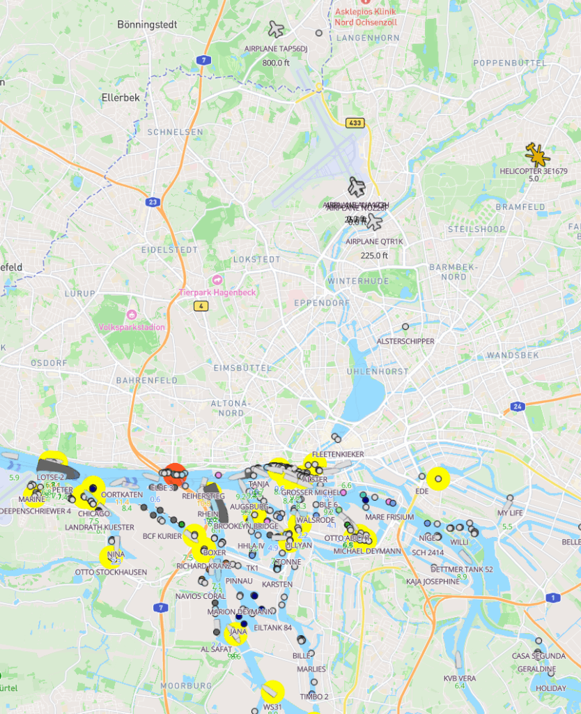
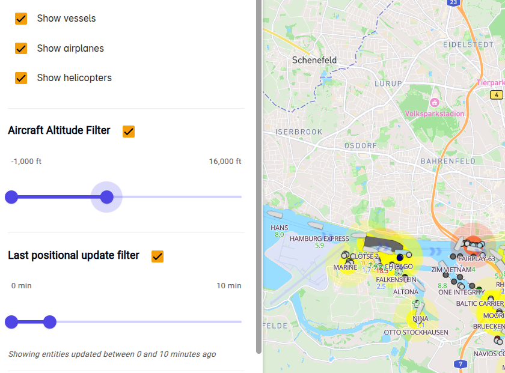

porttracker.co is not only about ships and AIS – but we also have clients that use helicopters and planes, and it is also fun not only to see vessels but also what is happening above your head. When you use porttracker.co you also can adjust what kind of flying objects you want to see and at what height.

