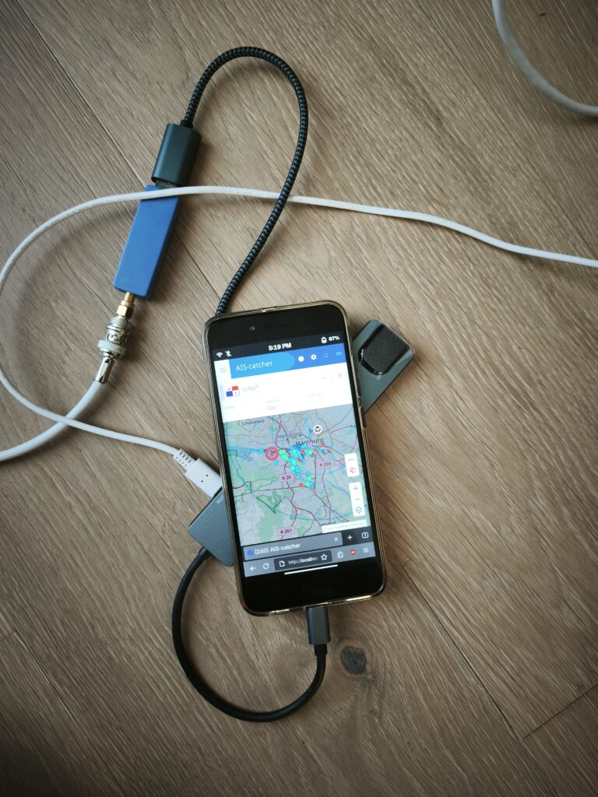

Since a couple of weeks ago, I’ve been using old phones as AIS receivers — and what can I say? These are the best AIS receivers I’ve ever used and had in my hands.

Using SDR sticks instead of traditional AIS receivers is obvious and already pretty much standard, since the sticks give you much better AIS reception quality, more data, more flexibility, and they’re cheaper. However, most of the time you still have to deal with some older or newer PIs that are a pain in everyone’s ass. Why? Cooling is a problem, they have no screens, Wi-Fi is sometimes messy and unreliable, they don’t have an LTE modem or GPS — so many features are missing that even an old phone has right out of the box.

The phone only has one problem — most of the time there’s a non-standard Android on it, which is not really open source, and you don’t really know what Android is doing. So, I removed Android and installed Linux on it, and now we can use all the nice tools like AIS-CATCHER, OPENCPM, SIGNALK, and even our own Docker containers run like a charm on it.

So, maybe old phones are the future of AIS receivers. At least they’re much better than what exists today in this space. Connect with me if you’re interested in this alternative — and join us at the AISSUMMIT 2025 in Hamburg where I’ll present this approach in my talk and at the exhibition.
