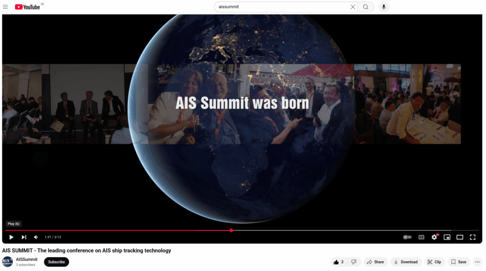

When I started my career with my first serious company, vesseltracker, the maritime data market was dominated by Lloyd’s Register (LR)/Fairplay. Later, some wise managers in the UK decided that LR should become a pure classification society and sold all their valuable data and software assets to IHS. Nowadays, some wise managers at LR want to turn back the clock and transform LR into a software and data company again. They’ve purchased several software companies, so they will be busy integrating everything over the next few years.

At the time of LR, and also later with IHS, they organized conferences mostly in London. However, these conferences were very expensive—around €1,500 per seat—boring, unfriendly, and lacked hospitality. The speakers were typically not interesting but rather those who paid to show endless PowerPoint slides for hours. When the conference ended, you were lucky to receive one or at most two warm beers before being kicked out of shabby conference rooms onto the street. Foreign visitors then spent lonely evenings at Burger King, or if lucky, in some old British pub eating fish and chips.

Later, when my company grew bigger and more important (we took clients from Glencore, T&R, Bloomberg, and others), they didn’t even invite me to their conferences anymore because they viewed me as a competitor.

So, it was time for a change, and I came up with my own conference—AIS Summit was born. The idea was simple: affordable attendance, anyone with something interesting to share could present, and good networking and social events. We didn’t want to kick lonely wolves onto the street but instead create a welcoming networking event. In 2011, we organized the first AIS Summit in Hamburg, with subsequent events in 2013, 2015 and 2018. People from all over the world came to Hamburg, enjoyed the networking opportunities, had fun, and exchanged valuable knowledge. Here is an old video from the 2015 event: [https://www.youtube.com/watch?v=lUp-C\_FZJEQ](https://www.youtube.com/watch?v=lUp-C_FZJEQ)

Because there was little innovation in this space over the last five years, I stopped AIS Summit and focused more on SeaDevCon and startup events. However, due to recent market changes and company shifts involving aggressive players like Kpler and S&P, I decided, together with my old friends Peter Stoyanov from Bulgaria and John Allen, former VP of Exact Earth, to bring AIS Summit back this November. We will meet in Hamburg at Kampnagel, a former ship-crane factory.

With so much happening in maritime AI, it is very beneficial to combine AI with AIS data and various other maritime data. Let’s see how this works out and explore the possibilities of combining AIS and AI.

If you are interested in joining AIS Summit or the maritime AI Summit, contact me. You can find all information on our conference website: www.aissummit.com.
